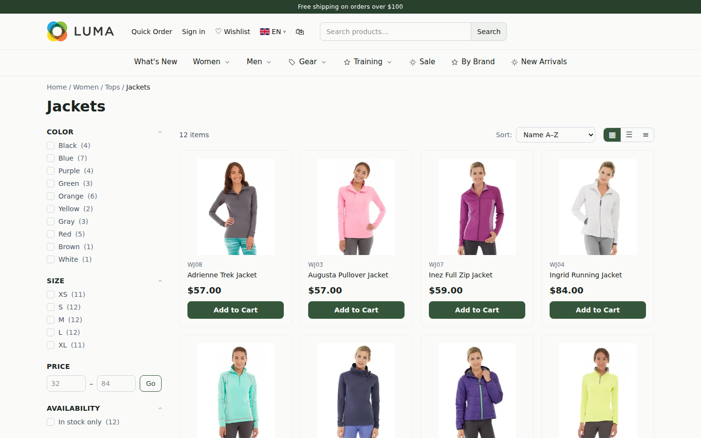
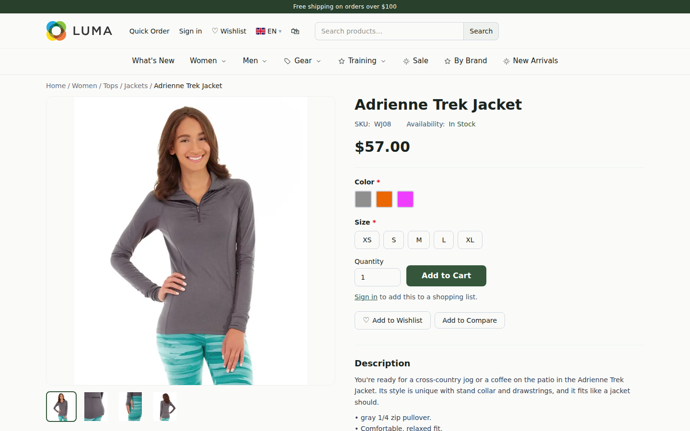
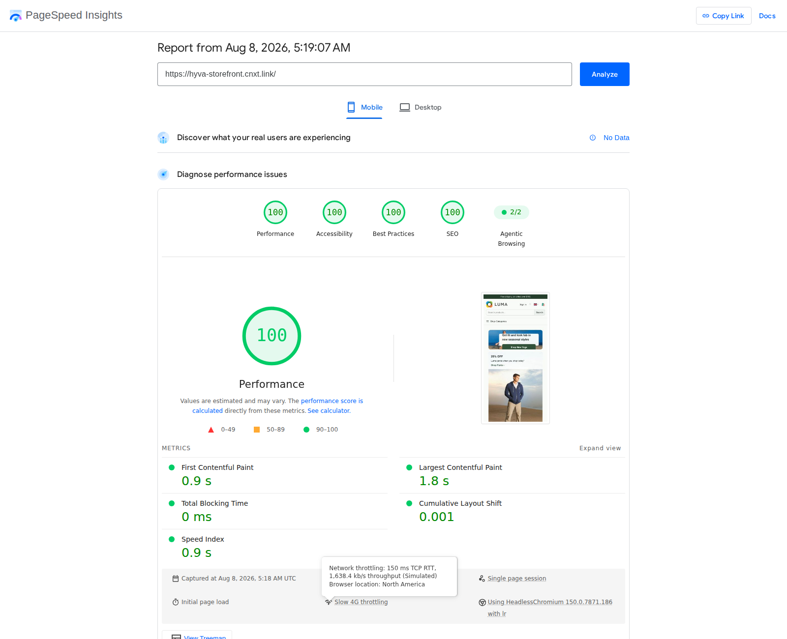

# Hyba — a Next.js rebuild of Magento's Hyvä theme

**Хіба** — Ukrainian for *"really?"* — which is the usual reaction to the benchmarks.

**Live demo:** [hyva-storefront.cnxt.link](https://hyva-storefront.cnxt.link) — running the Magento Luma sample catalog end to end (home, category/layered-nav, product/swatches, cart, checkout).

| Home | Category | Product |
|---|---|---|
| [](https://hyva-storefront.cnxt.link/) | [](https://hyva-storefront.cnxt.link/women/tops-women/jackets-women) | [](https://hyva-storefront.cnxt.link/women/tops-women/jackets-women/adrienne-trek-jacket) |

**Lighthouse**, same three pages, run against the live demo above:

| Home | Category | Product |
|---|---|---|
|  |  |  |

```bash
CHROME_PATH=<chrome> npx lighthouse https://hyva-storefront.cnxt.link/ \
  --chrome-flags="--headless --no-sandbox" --quiet \
  --only-categories=performance,accessibility,best-practices,seo
```

React Magento 2 module is one of the best things to happen to Magento frontend in years: it
replaced Blank/Luma's bloated RequireJS/Knockout stack with modern stack. 
Hyva uses the same approach and uses Alpine.js and
Tailwind, and made Magento storefronts fast again. But it's still built on
top of Magento's original rendering pipeline — `.phtml` templates, layout XML
merging, ViewModels, full-page-cache dependency. The frontend layer changed;
the engine underneath didn't.

Hyba asks a different question: what if the storefront wasn't PHP at all?

## The idea

Most engineering teams outside PHP shops don't want to write `.phtml` and
layout XML in 2026. They want React/Next.js-shaped tooling, an edge-renderable
frontend, and a backend they only ever talk to over an API. Hyba is that:
Magento (or any commerce backend) reduced to a pure data source, with a
Next.js application doing all of the rendering.

**This isn't a coupling to React, though.** Next.js is used here strictly as
the *backend layer* — Server Components, route handlers, the SSR/ISR
rendering pipeline — not as the UI framework. The actual frontend in this
repo is built with **Alpine.js islands**, deliberately mirroring Hyvä's own
approach: no client-side framework runtime ships to the browser, no
hydration, just server-rendered HTML with small inline `x-data` factories
attached where a control needs to be interactive (cart drawer, swatch
picker, layered nav). Nothing about the architecture requires Alpine
specifically — the same Next.js backend layer would serve a Vue, Svelte, or
plain-web-components frontend just as well. The commerce backend talks to
this layer exclusively through its API (GraphQL, REST, whatever it exposes);
there is no dependency on Magento's own presentation layer anywhere in this
codebase.

Performance follows directly from removing PHP template rendering from the
request path: with the frontend statically generated or edge-rendered and
the backend only ever asked to stream data, there's no per-request `.phtml`
rendering cost left to pay. Every page here ships **zero client-side
JavaScript by default** (forms are plain POSTs, navigation is plain links)
with Alpine.js opted in per-island only where real interactivity is needed.

## Architecture

```
src/app/                 Next.js App Router — layout.tsx (shell: Header + children + Footer),
                          (catalog)/ home · [...path] resolver · search, (customer)/ cart · checkout · account
src/components/           Server Components: Header, Footer, ProductDetail, ProductListing, …
src/components/hyba/      Alpine.js islands — CartDrawer, ConfigurablePanel, mini-search, and their
                          inline factory scripts (src/components/hyba/scripts/*.ts)
src/lib/provider/         DataProvider interface — every page reads through this, never a specific
                          backend's shape directly. Swap the implementation, keep every component.
src/lib/                  cart.ts (cookie), session.ts (cookie), actions.ts (server actions), types.ts
src/overrides/            Human CSS + component-override hooks — see THEMING.md
public/js/hyva/           bootstrap.mjs — the one script every page loads; starts Alpine, runs the
                          customer-section-data loop (cart/wishlist/compare state as one fetched
                          JSON blob broadcast as a window event, Hyvä's own pattern)
server.mjs                zero-JS production server — strips hydration scripts, gzips
```

**The `DataProvider` interface is the whole point.** Every component in
`src/components/` reads catalog/cart/customer data through one typed
interface (`src/lib/provider/index.ts`); nothing above that boundary knows or
cares what's on the other side. This repo ships that interface plus a couple
of reference implementations for local development — it does **not** ship a
backend. Point `DataProvider` at your commerce platform's API and the entire
frontend — routing, rendering, Alpine islands, theming — works unmodified.

## Rendering modes

Three levels of JavaScript, picked per route via `config.yaml`:

| Mode | Behavior |
|---|---|
| `zero` | Strip all hydration scripts — pure HTML/CSS, forms are MPA POSTs, Alpine islands still run (they're not React hydration) |
| `hybrid` | Hydrate only specific paths, zero-JS everywhere else |
| `full` | Alpine everywhere (this fork's default — every page, including cart/checkout/account, is Alpine-driven, matching Hyvä's own classic-MPA shape) |

## Theming

Three independent layers, lightest to heaviest — design tokens
(`src/app/theme.css`, a Tailwind 4 `@theme` block), semantic-class CSS
(`src/overrides/custom.css`, every element ships both a Tailwind utility set
*and* a stable human-readable class you can restyle without touching TSX —
the same approach as [Tailwind-Luna](https://github.com/Genaker/Tailwind-Luna)),
and component overrides (`overrides.yaml` + `src/overrides/*.tsx`) for when a
restyle needs new markup, not just new CSS. Full writeup in
[THEMING.md](THEMING.md).

## Quickstart

```bash
npm install
npm run build
npm start              # zero/hybrid/full per config.yaml, PORT=3000
# or during development:
npm run dev             # stock Next dev server with HMR
```

This repo is the **storefront application only** — no backend, no demo
dataset. `src/lib/provider/` includes a `gateway-provider.ts` client and a
handful of `raw-*-data.ts` providers for local development against a
compatible data service; wire `DATA_PROVIDER`/`GATEWAY_URL` (see
`.env.example`) at a real backend to run it for real. Without a configured
provider, pages render their shell but data-dependent sections have nothing
to read.

```bash
npm run test:unit        # node:test — factory logic, formatting, url helpers
npm run test:e2e          # playwright-core against the built zero-JS server
```

## Licensing note

Hyvä is a commercial, licensed Magento theme. This project does not copy its
CSS, JS, or `.phtml`/layout source — everything here is a from-scratch
re-implementation of the same architectural *spirit* (Alpine.js islands,
zero React hydration, semantic-class theming) in Next.js, including the
visual design tokens, which were derived by measuring the public demo
site's own computed styles (colors, radii, spacing) rather than transcribing
its stylesheet. If you're evaluating Hyvä for a real Magento project, [go
license it](https://hyva.io/) — it's a genuinely good theme for teams
staying on Magento's own rendering stack.

## Status

Early, actively evolving. Expect rough edges outside the paths that have
been hand-tested end to end (home, category/layered-nav, product/swatches,
cart drawer, checkout, account).
